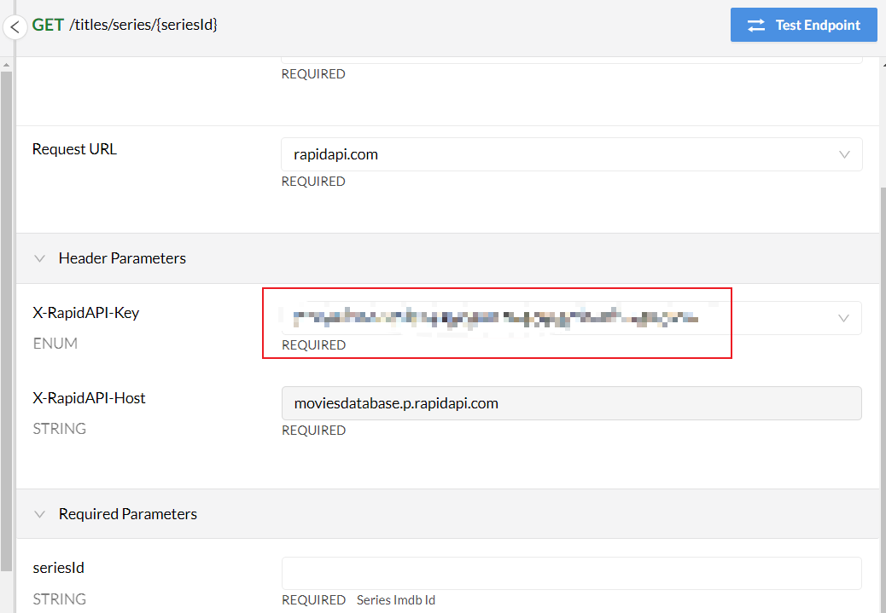
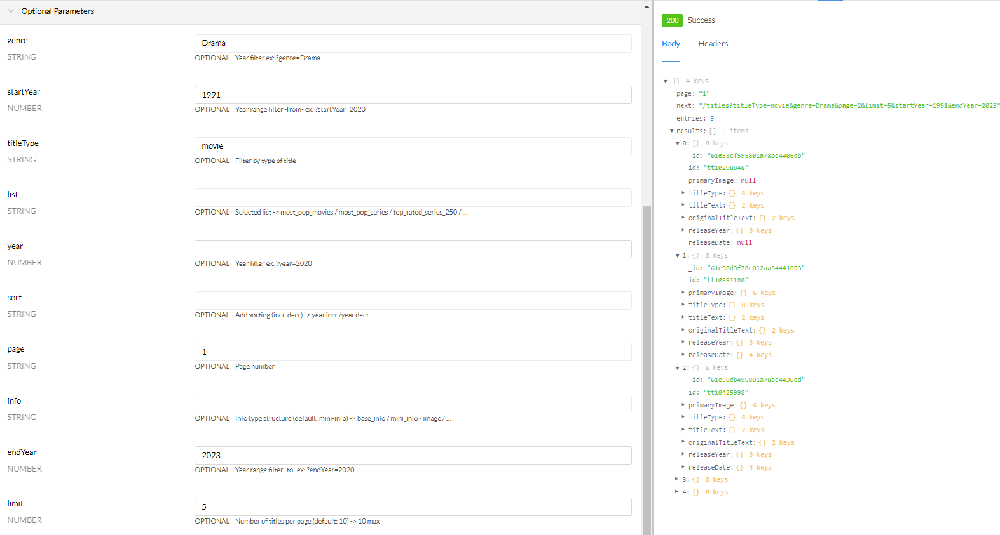
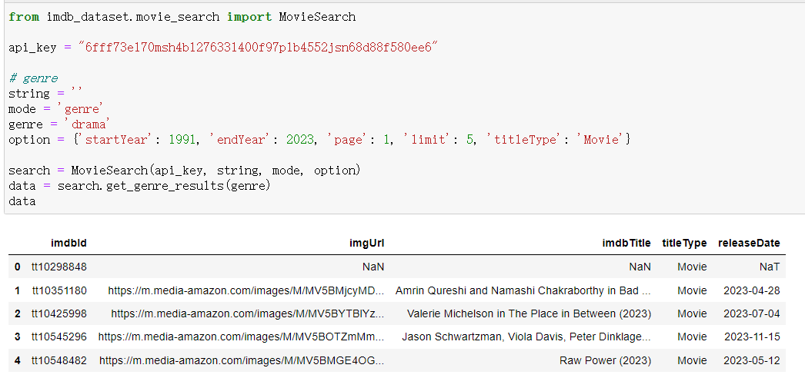

**Name of Project: IMDB Movie Data Search and Acquisition**

**Type of Project: API Client (B)**

## **Brief Description of the Project's Purpose**

The project sources its data from the MoviesDatabase API (https://rapidapi.com/SAdrian/api/moviesdatabase), which offers comprehensive access to entertainment data. This API opens the doors to an extensive entertainment data repository, providing complete and up-to-date information on over 9 million titles, spanning movies, series, and episodes. With weekly updates on recent titles, including daily updates on ratings and episode information, the API stands as a valuable resource for developers seeking rich and current content.

The IMDB_Dataset API project aims to seamlessly empower users with access to the dynamic world of the IMDB dataset. This Python package encompasses three key functionalities to enrich the user experience: initializing the API, searching for movies, and obtaining detailed information about movies. While the original MoviesDatabase API is powerful, it comes with a learning curve for developers and certain functionalities may involve redundancy. Additionally, JSON format data is not conducive to visualization and storage. Therefore, the purpose of the IMDB_Dataset API project is to encapsulate the MoviesDatabase API, providing a more simplified and user-friendly interface. This enables developers to access and leverage the content of the IMDB dataset with greater ease. The main goals of this project include:

1. **Simplify API Access:**
   - Provide an easy-to-use `ApiInitialize` class to streamline API key configuration and validation, reducing the learning and usage costs for developers.
   - Ensure the correctness and effectiveness of API keys through the `validate_api` method, boosting user confidence in API access.

2. **Intuitive Movie Search:**
   - Utilize the `MovieSearch` class to simplify the movie search process, supporting multiple search modes, including movie titles, aliases, keywords, IMDb IDs, and movie types.
   - Provide validation and handling of search parameters to ensure user inputs align with expectations, enhancing search accuracy.

3. **Detailed Movie Information Retrieval:**
   - Use the `MovieDetail` class to enable users to effortlessly retrieve detailed movie information, including ratings, aliases, and posters.
   - Return data in the Pandas DataFrame format, facilitating further data processing and analysis in Python.

4. **Visual Representation of Movie Information:**
   - Support the retrieval of movie posters for display in code or for saving as image files, offering a graphical way to showcase movie information and improve user experience.

5. **Provide Data in Tabular Form:**
   - Return data in the Pandas DataFrame format, allowing users to more easily manipulate and analyze data in Python.

6. **Flexible Optional Parameters:**
   - Support multiple optional parameters for each functionality, enabling users to customize API calls based on their requirements and increasing flexibility.

## Use Cases

- **Developers:**
  - Easily integrate IMDB dataset content into their applications to provide more entertainment information to their users.
- **Researchers:**
  - Leverage the convenience and data processing capabilities of the API for in-depth analysis and research on movie data.
- **Movie Enthusiasts:**
  - Retrieve information about movies of interest through simple API calls, effortlessly exploring the IMDB dataset.

Through this project, we aim to make it easier for users to harness the content of the IMDB dataset, catering to the diverse needs of developers, researchers, and movie enthusiasts alike. In summary, the IMDBDatasetDe API is a comprehensive and accessible tool designed for movie enthusiasts, researchers, and developers, offering a rich set of features to explore and analyze a vast IMDB dataset.

## Potential Challenges and Questions

At the beginning of development, it is necessary to study the calling method of API, and there is no obvious documentation. This step requires logging in to the website of Rapid API, which can be accessed through the link https://rapidapi.com/SAdrian/api/moviesdatabase, and then you can see the personal API_key in the location specified by Test Endpoint. It's easy to overlook that you need to subscribe in the Prince https://rapidapi.com/SAdrian/api/moviesdatabase/pricing interface (even if it's a free API interface).

After mastering the initial API calling method, we can see that there are many interfaces of MoviesDatabase API, and some of the interface function tests are complicated, which is not very friendly for beginners. This is also the main purpose of developing this API, which is convenient for users to get started quickly and get the information they want without spending time looking for it in the complex information world.

There is also a problem that the parameters given by the original API are not easy to understand and no detailed hints are given. All parameters are prompted in this API. For details, please refer to the readme document and code. In the process, the biggest problem is to consider how to combine some functions with only a few parameters. For example, genre, id and other methods can be combined in the search movie function. In addition, from the user's point of view, it is also one of the difficulties to think about their real intentions, remove redundant information and display the most concise and useful information.

Finally, in my API interface, I added a mechanism to judge the validity of the API, and also added a search method, and I can return the original JSON file to the required dataframe form. The specific comparison is as follows:

You can see that the structure given by the original API is complicated, and it is difficult to find the main information you want. My API integrates information and presents it concisely in the form of dataframe, which greatly improves the user experience. In addition, it is no longer necessary for users to struggle with the case format of input parameters, and it can automatically match API interfaces. This point, in the original API, the case error of parameter input will not be prompted, and the null result will be returned directly.

Display data in the form of dataframe, which is convenient for storage and analysis. In the API, the preservation and visualization of movie posters are also added, such as:

These functions are produced by step-by-step experiments in the process of constantly eliminating difficulties. Of course, there are also some problems at present, mainly because the speed of API accessing a large number of data may be slow, and there is a certain limit every month. These problems cannot be solved for the time being, but the current speed and quota will basically not affect the use of users.

**Relevant Links**

Rapid API:https://rapidapi.com/hub

MoviesDatabase API Documentation: https://rapidapi.com/SAdrian/api/moviesdatabase/details
